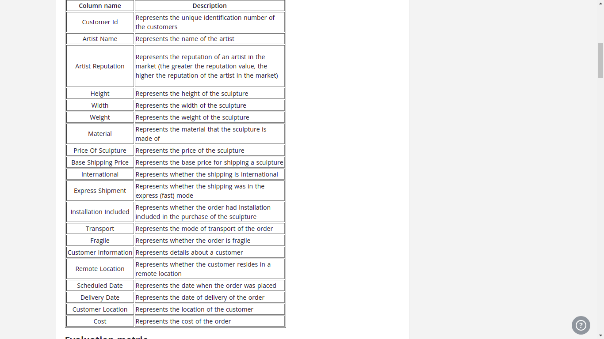
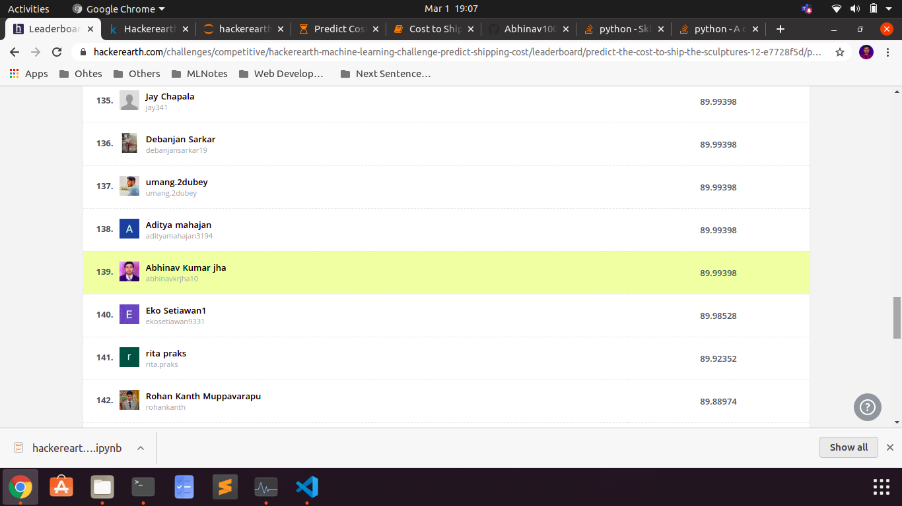

# HackerEarth-Exhibit-A-rt-
Gives solution of Hackerearth ML Challenge Exhibit A(rt)

# Problem Statement

### Predict the cost to ship the sculptures

You work for a company that sells sculptures that are acquired from various artists around the world. Your task is to predict the cost required to ship these sculptures to customers based on the information provided in the dataset.

# Dataset 

The dataset folder contains the following files:

* train.csv: 6500 x 20
* test.csv: 3500 x 19
* sample_submission.csv: 5 x 2
The columns provided in the dataset are as follows:

# Results

1. Random Forest Regressor worked better than other regression algorithms like linear regression,logistic regression 
2. Random Forest Regressor without hyperparameter tuning resulted in score of 65
3. For improvement of results hyperparameter tuning was done which resulted in score of 89.99

Final improved model resulted in the rank of 139 on the leaderboard

Competition [Link](https://www.hackerearth.com/challenges/competitive/hackerearth-machine-learning-challenge-predict-shipping-cost/machine-learning/predict-the-cost-to-ship-the-sculptures-12-e7728f5d/)

Leaderboard 
